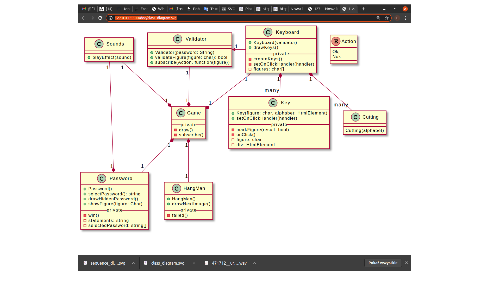

# Hangman
This is a game in which the user's task is to guess the password. The password is hidden and the letters are replaced by a row of dashes, representing each letter of the word. The guesser chooses the letter from the keybord and if the password contains this letter, it is displayed on the screen in proper place. The guesser can win by guessing all the letters that appears in the password. If the password does not contains the chosen letter, the guesser is penalized by adding an element to the diagram - the element of the gallows. If the guesser makes enough incorrect attempts the complete picture hangman is displaying in the screen.

# Features
The game is for one user which guessing a draw password. User can choose a letter by clicking a mouse the letter on the keyboard

# Technologies
JavaScript, CSS, HTML

# Supported Platforms
Google Chrome - version 73.0.3683.103 and higher  
Mozilla Firefox - version 66.0.3 and higher
Opera - version 58.0.3135.132 and higher

# Architecture

# Authors  
Slawomir Nowicki (Architecture, JavaScript)  
Lukasz Sitnik (JavaScript, CSS, HTML, graphic)
